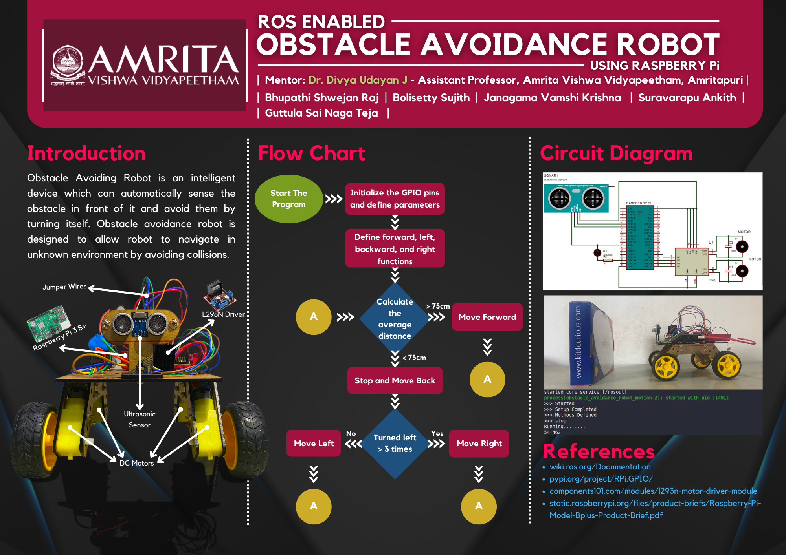

# Obstacle Avoidance Robot

</a>

## Introduction
Obstacle Avoiding Robot is an intelligent device which can automatically sense the obstacle in front of it and avoid them by turning itself.

Obstacle avoidance robot is designed to allow robot to navigate in unknown environment by avoiding collisions.

## Components Used
- Rasberry pi 3b+
- L298 Motor driver
- HC-SR04 Ultrasonic sensor
- 4 x 4 chassis board
- 4 DC motors
- 4 Gear reducers
- 4 Tyres
- M-F, F-F Connecting wires.

</a>

### Team Members:
- [Bhupathi Shwejan Raj](https://github.com/shwejanraj)
- [Bolisetty Sujith](https://bolisettysujith.rocks)
- [Janagama Vamshi Krishna](https://github.com/vamshijanagama)
- [Suravarapu Ankith](https://github.com/Ankith-Suravarapu)
- [Guttula Sai Naga Teja]()
